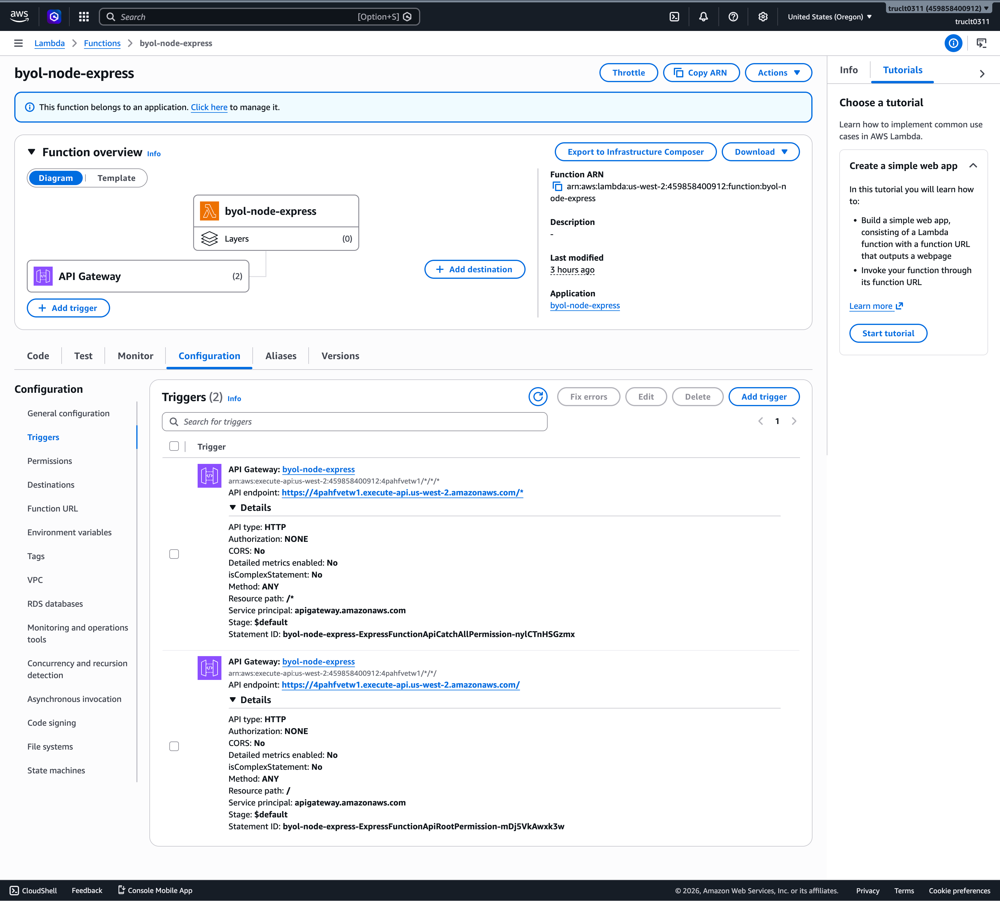

# Ghi chú triển khai

## Chiến lược đã chọn

Em chọn `serverless-http` để đưa Express app hiện tại lên AWS Lambda.

Các thay đổi chính:

- Thêm `lambda.js` làm entrypoint cho Lambda.
- Thêm dependency `serverless-http`.
- Cập nhật `template.yaml` từ `Handler: TODO_FILL_IN` thành `Handler: lambda.handler`.
- Giữ nguyên `app.js` và `server.js`, nên app vẫn chạy local bằng `npm start`.

Phần logic chạy Lambda thực sự nằm ở `lambda.js`:

```js
const serverless = require('serverless-http');
const app = require('./app');

exports.handler = serverless(app);
```

## Lý do chọn

Đây là cách thay đổi ít và rõ ràng nhất cho một Express app có sẵn:

- Không rewrite route.
- Không đưa code Lambda-specific vào `app.js`.
- Không tự viết code parse event từ API Gateway.
- Không làm hỏng cách chạy local bằng `server.js`.
- Chỉ cần một adapter nhỏ để chuyển request từ API Gateway/Lambda sang Express.

Không chọn AWS Lambda Web Adapter vì tuy gần như không sửa JavaScript, nhưng cần thêm Lambda Layer và cấu hình runtime phức tạp hơn. Với bài này, một entrypoint adapter ngắn sẽ dễ review và debug hơn.

## Triển khai

- Region: `us-west-2`
- Stack: `byol-node-express`
- API Gateway URL: `https://4pahfvetw1.execute-api.us-west-2.amazonaws.com`

Các lệnh smoke test:

```bash
curl https://4pahfvetw1.execute-api.us-west-2.amazonaws.com/
curl https://4pahfvetw1.execute-api.us-west-2.amazonaws.com/api/hello/Lan
curl -X POST https://4pahfvetw1.execute-api.us-west-2.amazonaws.com/api/echo \
  -H 'Content-Type: application/json' \
  -d '{"hi":"there"}'
```

Kết quả: cả 3 endpoint đều trả về đúng JSON giống khi chạy Express local.

## Bằng chứng trên AWS Console

Ảnh bên dưới cho thấy Lambda function `byol-node-express` đã được gắn với API Gateway HTTP API ở region `us-west-2`, có route `ANY /` và `ANY /{proxy+}`:



## Cold start

Đo từ các dòng `REPORT` trong CloudWatch log group `/aws/lambda/byol-node-express` sau khi deploy:

- `Init Duration: 274.57 ms`
- `Init Duration: 333.75 ms`
- `Init Duration: 335.31 ms`

Cold start trung bình báo cáo: khoảng `315 ms`.

